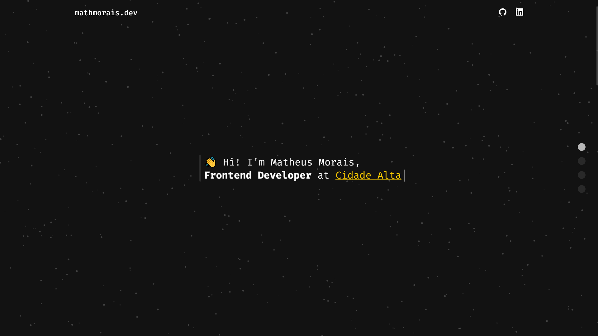

### 💻 Demo



[Deploy](https://challenge-cidade-alta.vercel.app)

### ⚡ Como iniciar

Instale as dependencias com o seu gerenciador de pacotes

Como **npm**

```bash
 npm install
```

Ou **yarn**

```bash
 yarn install
```

Após declarar as variaveis ambientes em um arquivo .env, inicialize o projeto em ambiente de desenvolvimento atravéz do comando:

```bash
 yarn dev
```

### 🧑‍🔬 Principais techs

- ReactJS
- NextJS
- TypeScript
- Styled-Components
- Axios
- Keystone
